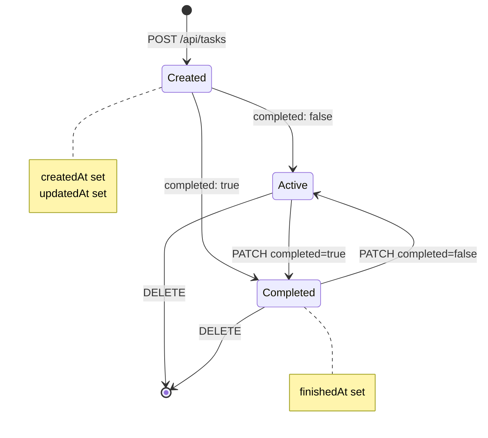

## Overview

Task Manager is a full-stack task management application that provides both a RESTful API and an intuitive web interface for organizing and tracking tasks. Built with Node.js and Express, it offers a lightweight yet powerful solution for personal and team task organization through hierarchical categorization.

<Info>
Task Manager uses **db-local** for data persistence, eliminating the need for external database setup while maintaining full CRUD functionality and data integrity.
</Info>

## Key Features

<CardGroup cols={2}>
  <Card title="RESTful API" icon="code">
    Complete REST API with standardized endpoints for tasks and categories, supporting filtering, validation, and referential integrity
  </Card>
  <Card title="Task Lifecycle Management" icon="clock">
    Automatic timestamp tracking with `createdAt`, `updatedAt`, and `finishedAt` fields that respond to task state changes
  </Card>
  <Card title="Hierarchical Categories" icon="folder-tree">
    Organize tasks into custom categories with automatic reassignment to "uncategorized" when categories are deleted
  </Card>
  <Card title="Data Validation" icon="shield-check">
    Zod-powered schema validation ensures data integrity with automatic sanitization and type checking
  </Card>
</CardGroup>

## Architecture

Task Manager follows a modular, layered architecture that separates concerns and promotes maintainability:

### Backend Structure

```
src/
├── controllers/      # HTTP request/response handlers
├── models/          # Data access layer and business logic
├── schemas/         # Zod validation schemas
├── routes/          # API endpoint definitions
├── middlewares/     # CORS, authentication, logging
├── DB/              # Database schemas and JSON storage
└── index.js         # Application entry point
```

**Layer Responsibilities:**

- **Controllers** (`src/controllers/task.js:1`) - Handle HTTP requests, invoke models, and format responses
- **Models** (`src/models/task.js:1`) - Contain business logic, interact with database, manage data transformations
- **Schemas** (`src/schemas/task.js:1`) - Define validation rules using Zod for type safety and data integrity
- **Routes** (`src/routes/tasks.js:1`) - Map HTTP methods to controller functions

### Frontend Structure

```
public/
├── js/
│   ├── controllers/  # UI event handlers
│   ├── services/     # API client services
│   ├── views/        # Component rendering logic
│   └── utils/        # Helper functions
├── styles/           # CSS modules
└── index.html        # Single-page application entry
```

<Note>
The frontend follows an MVC-inspired pattern where services handle API communication, views manage rendering, and controllers coordinate user interactions.
</Note>

## Core Concepts

### Tasks

Tasks are the fundamental entity in Task Manager. Each task contains:

- **Unique identifier** - UUID v4 generated using Node.js crypto module
- **Title** - Required, 3-25 characters
- **Description** - Optional, up to 25 characters
- **Completion status** - Boolean flag with automatic `finishedAt` timestamp
- **Category assignment** - Links to a category or defaults to "uncategorized"
- **Lifecycle timestamps** - Automatic tracking of creation, updates, and completion

**Task State Diagram:**



### Categories

Categories provide hierarchical organization for tasks:

- **UUID-based identification** - Each category has a unique ID
- **Name requirement** - Must be unique and non-empty
- **Referential integrity** - Deleting a category reassigns tasks to "uncategorized"
- **Batch operations** - Support for deleting multiple categories at once

<Warning>
When categories are deleted via `POST /api/taskCategories/delete`, all associated tasks are automatically reassigned to "uncategorized". This operation cannot be undone.
</Warning>

## Technology Stack

### Backend Dependencies

| Package | Version | Purpose |
|---------|---------|----------|
| **express** | 5.1.0 | Web framework for API routing and middleware |
| **db-local** | 3.1.0 | File-based JSON database with query support |
| **zod** | 4.1.12 | Schema validation and runtime type checking |
| **cors** | 2.8.5 | Cross-origin resource sharing middleware |
| **dotenv** | 17.2.3 | Environment variable management |

### Data Persistence

Task Manager uses **db-local**, a lightweight JSON-based database that:

- Stores data in `./src/DB/` directory as JSON files
- Provides MongoDB-like query syntax (`$in`, `findOne`, etc.)
- Requires no external database server
- Supports schema definitions with type validation

Example schema definition from `src/DB/DB_schemas.js:6`:

```javascript
export const Tasks = Schema('tasks', {
  _id: { type: String, required: true },
  title: { type: String, required: true },
  description: { type: String },
  completed: { type: Boolean, default: false },
  createdAt: { type: String, required: true },
  updatedAt: { type: String },
  finishedAt: { type: String },
  categoryId: { type: String, default: "" }
});
```

## Use Cases

<Accordion title="Personal Task Management">
Individuals can organize daily tasks, categorize them by project or priority, and track completion status. The web interface provides quick access to create, update, and mark tasks as complete.
</Accordion>

<Accordion title="API Integration">
Developers can integrate Task Manager's REST API into other applications, mobile apps, or automation scripts. All task operations are accessible via standard HTTP methods.
</Accordion>

<Accordion title="Project Organization">
Teams can use categories to separate tasks by project, department, or sprint. The referential integrity ensures tasks aren't lost when reorganizing categories.
</Accordion>

<Accordion title="Lightweight Deployment">
With no external database requirements, Task Manager can be deployed on minimal infrastructure - perfect for personal servers, development environments, or small-scale production use.
</Accordion>

## Design Principles

### RESTful API Standards

Task Manager adheres to REST principles:

- **Resource-based URLs** - `/api/tasks`, `/api/taskCategories`
- **HTTP method semantics** - GET (read), POST (create), PATCH (update), DELETE (remove)
- **Proper status codes** - 200 (OK), 201 (Created), 204 (No Content), 400 (Bad Request), 404 (Not Found)
- **JSON content type** - All requests and responses use `application/json`

### Data Integrity

From `src/API.md:10`:

- **UUID v4** for all entity identifiers using `node:crypto`
- **ISO 8601** date format for all timestamps
- **Zod validation** for input sanitization and type checking
- **String trimming** to remove leading/trailing whitespace

### Automatic Timestamp Management

The system intelligently manages timestamps based on task state transitions (`src/models/task.js:52`):

```javascript
// When task is completed
if (oldCompleted === false && newCompleted === true) {
  cleanInputData.finishedAt = new Date().toISOString();
}
// When task is reopened
if (oldCompleted === true && newCompleted === false) {
  delete taskExists.finishedAt;
}
```

<Tip>
Timestamps are read-only from the client perspective - they're automatically managed by the backend to ensure accuracy and prevent tampering.
</Tip>

## Next Steps

<CardGroup cols={2}>
  <Card title="Quickstart Guide" icon="rocket" href="/quickstart">
    Get up and running in minutes with our step-by-step installation guide
  </Card>
  <Card title="API Reference" icon="book" href="/api/overview">
    Explore all available endpoints, request formats, and response schemas
  </Card>
</CardGroup>